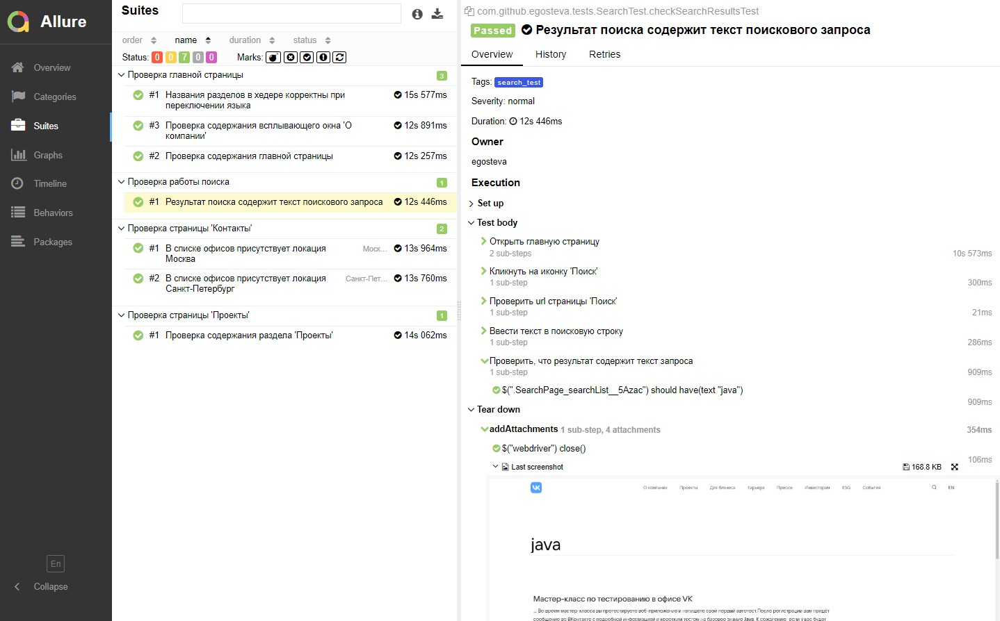

<h1 >Проект автоматизации тестирования UI для сайта <a href="https://vk.company/ru/ ">VK Company</a></h1>


## :bookmark_tabs: Содержание

* <a href="#tools">Технологии и инструменты</a>

* <a href="#cases">Реализованные проверки</a>

* <a href="#console">Запуск тестов из терминала</a>

* <a href="#jenkins">Запуск тестов в Jenkins</a>

* <a href="#allure">Отчеты в Allure Report</a>

* <a href="#allure-testops">Интеграция с Allure TestOps</a>

* <a href="#jira">Интеграция с Jira</a>

* <a href="#telegram">Уведомления в Telegram с использованием бота</a>

* <a href="#video">Пример прогона теста в Selenoid</a>

<a id="tools"></a>
## Технологии и инструменты

| Java                                                                                                    | IntelliJ Idea                                                                                                                | GitHub                                                                                                    | JUnit 5                                                                                                          | Gradle                                                                                                    | Selenide                                                                                                        | Selenoid                                                                                                                 |                                                                                                         Jenkins |
|:--------------------------------------------------------------------------------------------------------|------------------------------------------------------------------------------------------------------------------------------|-----------------------------------------------------------------------------------------------------------|------------------------------------------------------------------------------------------------------------------|-----------------------------------------------------------------------------------------------------------|-----------------------------------------------------------------------------------------------------------------|--------------------------------------------------------------------------------------------------------------------------|----------------------------------------------------------------------------------------------------------------:|
| <a href="https://www.java.com/"></a> | <a id ="tech" href="https://www.jetbrains.com/idea/"></a> | <a href="https://github.com/"></a> | <a href="https://junit.org/junit5/"></a> | <a href="https://gradle.org/"></a> | <a href="https://selenide.org/"></a> | <a href="https://aerokube.com/selenoid/"></a> | <a href="https://www.jenkins.io/"></a> |


| Jira                                                                                                                         | Allure                                                                                                                    | Allure TestOps                                                                                                      |
|:-----------------------------------------------------------------------------------------------------------------------------|---------------------------------------------------------------------------------------------------------------------------|---------------------------------------------------------------------------------------------------------------------|
| <a href="https://www.atlassian.com/ru/software/jira"></a> | <a href="https://github.com/allure-framework"></a> | <a href="https://qameta.io/"></a> |

<a id="cases"></a>
## :ballot_box_with_check: Реализованные проверки

- :small_blue_diamond: Проверка содержания главной страницы
- :small_blue_diamond: Названия разделов в хедере корректны при переключении языка
- :small_blue_diamond: Проверка содержания всплывающего окна "О компании"
- :small_blue_diamond: Параметризованный тест проверки локации в списке офисов
- :small_blue_diamond: Проверка результатов поиска
- :small_blue_diamond: Проверка содержания раздела "Проекты"

<a id="console"></a>
## :computer: Запуск тестов из терминала
### Локальный запуск тестов

```bash
gradle clean test -Denv=local
```

### Удаленный запуск тестов

```bash
gradle clean test -Denv=remote
"-Dbrowser=${BROWSER}" 
"-DbrowserVersion=${BROWSER_VERSION}" 
"-DbrowserSize=${BROWSER_SIZE}" 
"-DremoteUrl=${REMOTE_URL}"
"-DbaseUrl=${BASE_URL}"
```

`${BROWSER}` - наименование браузера (_по умолчанию - <code>chrome</code>_).

`${BROWSER_VERSION}` - версия браузера (_по умолчанию - <code>100.0</code>_).

`${BROWSER_SIZE}` - размер окна браузера (_по умолчанию - <code>1920x1080</code>_).

`${REMOTE_URL}` - адрес удаленного сервера, на котором будут запускаться тесты.
 
`${BASE_URL}` - адреc главной страницы тестируемого сайта.
 

<a id="jenkins"></a>
## </a> Запуск тестов в Jenkins

<a target="_blank" href="https://jenkins.autotests.cloud/job/Students/job/final_project_ui_test ">Сборка в Jenkins</a>
<p align="center">

<p align="center">
<a></a>
</p>

Сборка с параметрами

<a href="https://jenkins.autotests.cloud/job/Students/job/final_project_ui_test/build"></a>

Из Jenkins возмжно перейти в Allure Report и Allure TestOps.

<a id="allure"></a>
## </a> Отчеты в [Allure Report](https://jenkins.autotests.cloud/job/Students/job/final_project_ui_test/21/allure/)

### Главная страница

<p align="center">

</p>

### Тест-кейсы

К каждому тест-кейсу прикреплен скриншот страницы последнего шага, логи и видео.

<p align="center">

</p>

<a id="allure-testops"></a>
## </a> Интеграция с [Allure TestOps](https://allure.autotests.cloud/project/3317/dashboards)

Интеграция Allure TestOps с Jenkins позволяет следить за выполнением прогона и управлять запуском тест-кейсов.

### Главная страница

<p align="center">

</p>


### Тест-кейсы

<p align="center">

</p>


<a id="jira"></a>
## </a> Интеграция с [Jira](https://jira.autotests.cloud/browse/HOMEWORK-736)

### Интеграция Jira и Allure TestOps
<p align="center">

</p>


<a id="telegram"></a>
## </a> Уведомления в Telegram с использованием бота

<p >

</p>

<a id="video"></a>
## </a> Пример прогона теста в Selenoid

Видео к прохождению теста "Проверки локации "Москва" в списке офисов.
<p align="center">
  
</p>
